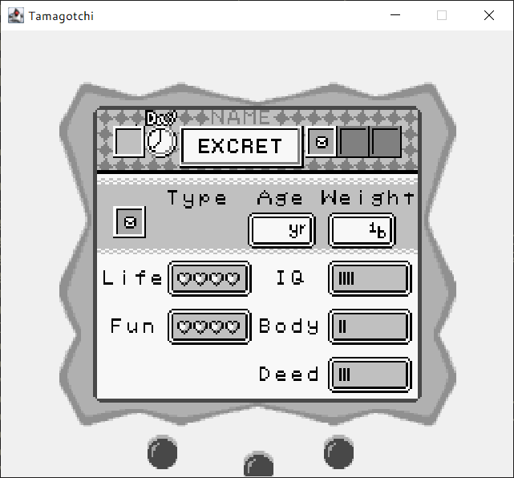
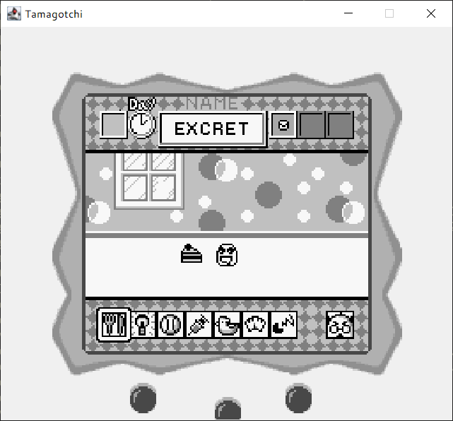

# Tamagotchi

## Como ejecutar el juego

1. **Compilar los archivos Java**

  Abre una terminal y navega a la carpeta raíz del proyecto. Luego ejecuta:

  ```bash
  javac src/*.java -d bin
  ```

2. **Copiar los archivos de recursos**

  Copia todos los archivos de la carpeta `resources` a la carpeta `bin` (o donde se encuentren los `.class` compilados):

  ```bash
  cp -r resources/* bin/
  ```

3. **Ejecutar el juego**

  Desde la carpeta raíz, ejecuta el archivo principal (reemplaza `Main` por el nombre de tu clase principal si es diferente):

  ```bash
  java -cp bin main.Main
  ```

¡Listo! El juego debería iniciarse correctamente.

4. **Capturas de pantalla**

<p align="center">
  
</p>

<p align="center">
  
</p>

<p align="center">
  
</p>

<p align="center">
  
</p>

